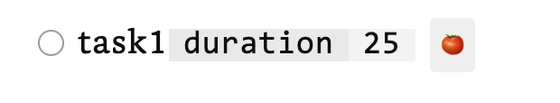
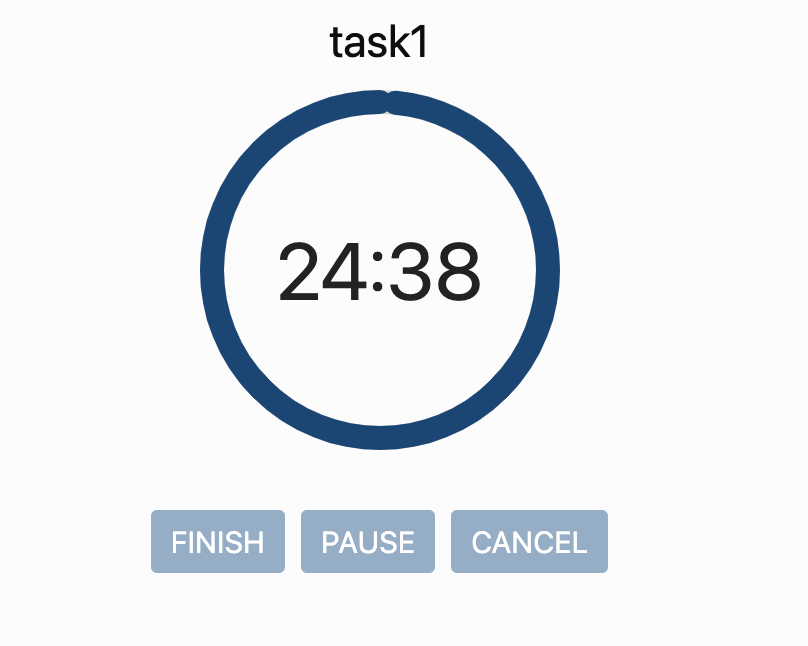
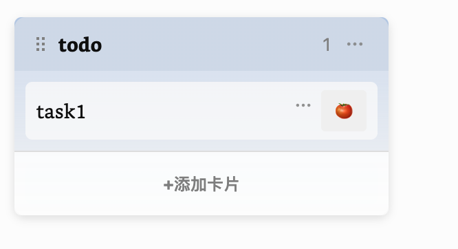
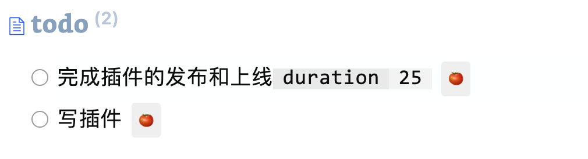

# obsidian-pomodoro-task

Add a pomodoro clock icon after each task in the reading view. Clicking the icon will start the pomodoro timer, and the duration will be automatically recorded after the pomodoro session ends. The duration can be queried using the dataview plugin.

Supports task lists in Markdown format, kanban plugin, lists queried by the tasks plugin, and lists queried by the dataview plugin.

## Examples

### Native Markdown Task List

### Kanban Plugin

### Tasks Plugin

Cannot use short mode, need the reverse link to locate the task file

### Dataview Plugin

Use subheadings to locate the task file

## Note

**The method used to add duration is to first find the file, and then match the task text. If there are tasks with the same name in the same file, the duration will be added to the wrong task.**
**Because the text matching uses includes, do not include other tasks completely in the task text. For example, if there are two tasks named "Test Task" and "Urgent Test Task", clicking "Test Task" will match "Urgent Test Task". It is better to name them "Normal Test Task" and "Urgent Test Task" to avoid overlapping text.**
**If a better method is found to locate the corresponding task, it will be improved.**

## Roadmap

-   [ ] Support custom pomodoro duration
-   [ ] Support custom pomodoro icon
-   [ ] Better task querying and updating capabilities

# obsidian-pomodoro-task

在阅读视图下每个任务后面加上番茄钟图标，点击图标可以开始番茄钟，番茄钟结束后会自动记录时长属性到任务后面。后续可以通过 dataview 插件查询任务的番茄钟时长。
支持 md 任务列表、kanban 插件、tasks 插件查询的列表、dataview 查询的列表。

## 例子

### 原生 md 任务列表

### kanban 插件

### tasks 插件

不能使用 short mode，需要后面的反向链接来定位任务文件

### dataview 插件

使用小标题来定位任务文件

## 注意

**添加时长采用的方法是先寻找文件，接着匹配任务文字，如果在同一个文件内有同名任务，会导致时长添加的位置错误。**
**因为匹配文字使用的是 includes，所以任务文字不要完全地包含其他任务。比如有两个任务，如果命名为：【测试任务、测试任务紧急】，会导致在点击《测试任务》的时候被匹配到《测试任务紧急》上，最好命名为【测试任务正常、测试任务紧急】这种无法相互包含的文字**
**如果后续能找到更好的办法找到对应的任务，会改进**

## roadmap

-   [ ] 支持自定义番茄钟时长
-   [ ] 支持自定义番茄钟图标
-   [ ] 更好的任务查询及更新
